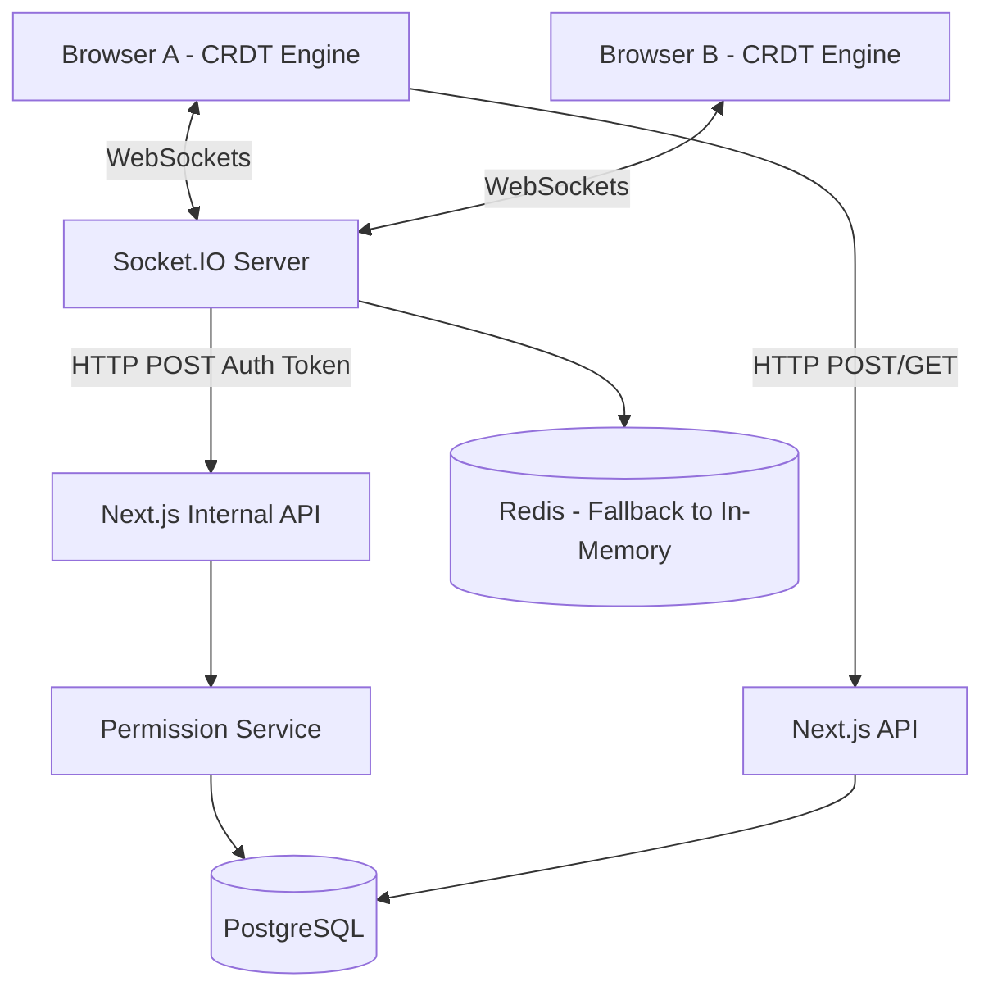

# Project Status

**Overall Completion:** 80%

## Completed Milestones

- **Milestone 1:** Basic Setup & Authentication (Next.js, Prisma, NextAuth)
- **Milestone 2:** Document Management (CRUD, Permissions)
- **Milestone 3:** Local-First Synchronization Engine (IndexedDB, Dexie, CRDT, Lamport Clock)
- **Milestone 4:** Real-Time Collaboration (Socket.IO server, WebSocket transport, Authentication integration)

## Remaining Milestones

- **Milestone 5:** UI/UX & Polish (Editor interface, real-time presence indicators, deployment preparation)

## Folder Structure

```text
C:\collab-docs
├── app/                  # Next.js Application Route Handlers and Pages
│   ├── api/              # API Routes (Internal, Auth, Documents)
│   ├── e2e/              # Playwright E2E test pages
│   └── ...
├── client/               # Local-First Synchronization Engine
│   ├── sync/             # Operation CRDT, Lamport Clocks, Engine
│   └── db/               # Dexie IndexedDB Schema
├── docs/                 # Project Documentation and Reports
├── e2e/                  # Playwright E2E Tests
├── server/               # Next.js Backend Services & Repositories
│   ├── services/
│   └── repositories/
├── socket-server/        # Independent Socket.IO Node.js Server
│   ├── src/
│   │   ├── events/       # Socket Handlers
│   │   ├── middlewares/  # Socket Auth Middlewares
│   │   ├── services/     # Cache & Internal API Client
│   │   └── ...
└── prisma/               # Database Schema
```

## Current Architecture Diagram



## Known Limitations

- Redis connection falls back to in-memory adapter during tests since Redis is not spun up in CI currently.
- Playwright tests require an artificial delay in the setup block to ensure the Next.js server has properly started and connected to the database before the socket tests run.
- WebSocket payloads currently batch at a hardcoded 50ms interval.

## Future Improvements

- **Redis Integration:** Fully integrate Redis for Socket.IO horizontal scaling and cross-server broadcasting.
- **Yjs/Automerge Evaluation:** While the custom Lamport Clock CRDT works well for text, evaluating standard CRDT libraries for complex nested structures (like rich text) could be beneficial.
- **Observability:** Integrate OpenTelemetry as prepared in the logger service for distributed tracing between Next.js and the Socket server.
- **Queue Retry Mechanism:** Improve the offline queue backoff retry system.
