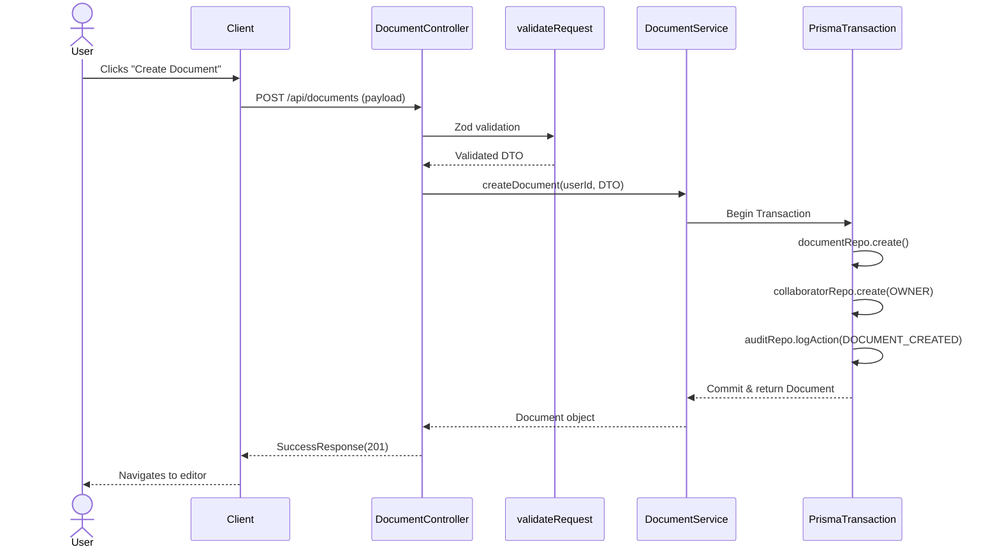
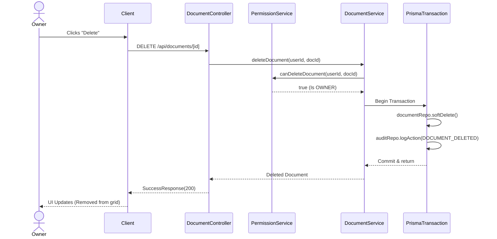
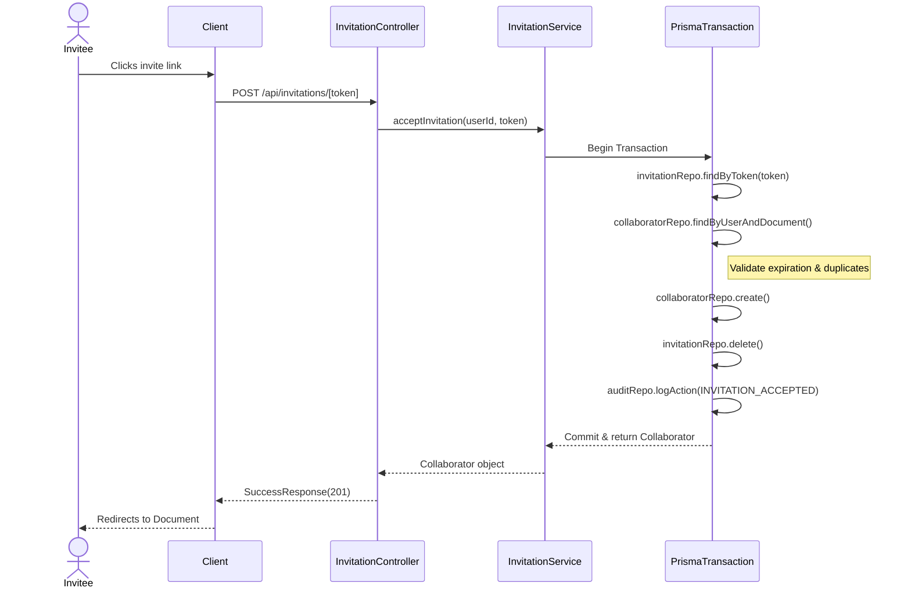

# Sequence Diagrams

## Create Document

```mermaid
sequenceDiagram
    actor User
    participant Client
    participant DocumentController
    participant validateRequest
    participant DocumentService
    participant PrismaTransaction

    User->>Client: Clicks "Create Document"
    Client->>DocumentController: POST /api/documents (payload)
    DocumentController->>validateRequest: Zod validation
    validateRequest-->>DocumentController: Validated DTO
    DocumentController->>DocumentService: createDocument(userId, DTO)

    DocumentService->>PrismaTransaction: Begin Transaction
    PrismaTransaction->>PrismaTransaction: documentRepo.create()
    PrismaTransaction->>PrismaTransaction: collaboratorRepo.create(OWNER)
    PrismaTransaction->>PrismaTransaction: auditRepo.logAction(DOCUMENT_CREATED)
    PrismaTransaction-->>DocumentService: Commit & return Document

    DocumentService-->>DocumentController: Document object
    DocumentController-->>Client: SuccessResponse(201)
    Client-->>User: Navigates to editor
```

## Delete Document

```mermaid
sequenceDiagram
    actor Owner
    participant Client
    participant DocumentController
    participant PermissionService
    participant DocumentService
    participant PrismaTransaction

    Owner->>Client: Clicks "Delete"
    Client->>DocumentController: DELETE /api/documents/[id]
    DocumentController->>DocumentService: deleteDocument(userId, docId)

    DocumentService->>PermissionService: canDeleteDocument(userId, docId)
    PermissionService-->>DocumentService: true (Is OWNER)

    DocumentService->>PrismaTransaction: Begin Transaction
    PrismaTransaction->>PrismaTransaction: documentRepo.softDelete()
    PrismaTransaction->>PrismaTransaction: auditRepo.logAction(DOCUMENT_DELETED)
    PrismaTransaction-->>DocumentService: Commit & return

    DocumentService-->>DocumentController: Deleted Document
    DocumentController-->>Client: SuccessResponse(200)
    Client-->>Owner: UI Updates (Removed from grid)
```

## Accept Invitation

```mermaid
sequenceDiagram
    actor Invitee
    participant Client
    participant InvitationController
    participant InvitationService
    participant PrismaTransaction

    Invitee->>Client: Clicks invite link
    Client->>InvitationController: POST /api/invitations/[token]
    InvitationController->>InvitationService: acceptInvitation(userId, token)

    InvitationService->>PrismaTransaction: Begin Transaction
    PrismaTransaction->>PrismaTransaction: invitationRepo.findByToken(token)
    PrismaTransaction->>PrismaTransaction: collaboratorRepo.findByUserAndDocument()
    Note right of PrismaTransaction: Validate expiration & duplicates
    PrismaTransaction->>PrismaTransaction: collaboratorRepo.create()
    PrismaTransaction->>PrismaTransaction: invitationRepo.delete()
    PrismaTransaction->>PrismaTransaction: auditRepo.logAction(INVITATION_ACCEPTED)
    PrismaTransaction-->>InvitationService: Commit & return Collaborator

    InvitationService-->>InvitationController: Collaborator object
    InvitationController-->>Client: SuccessResponse(201)
    Client-->>Invitee: Redirects to Document
```
