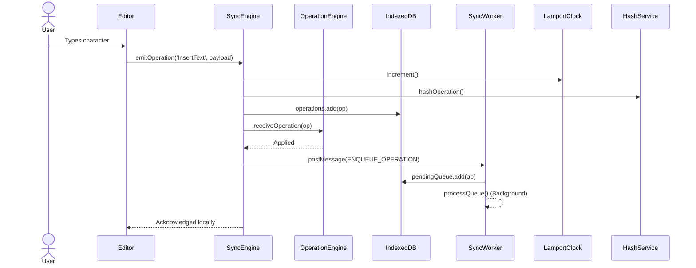
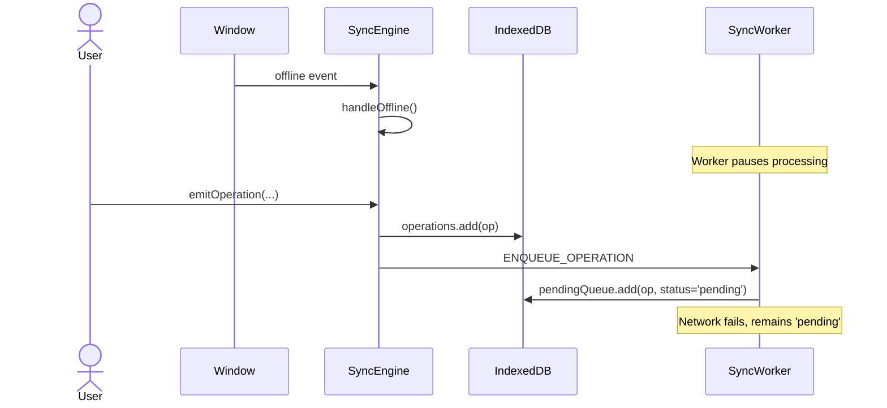
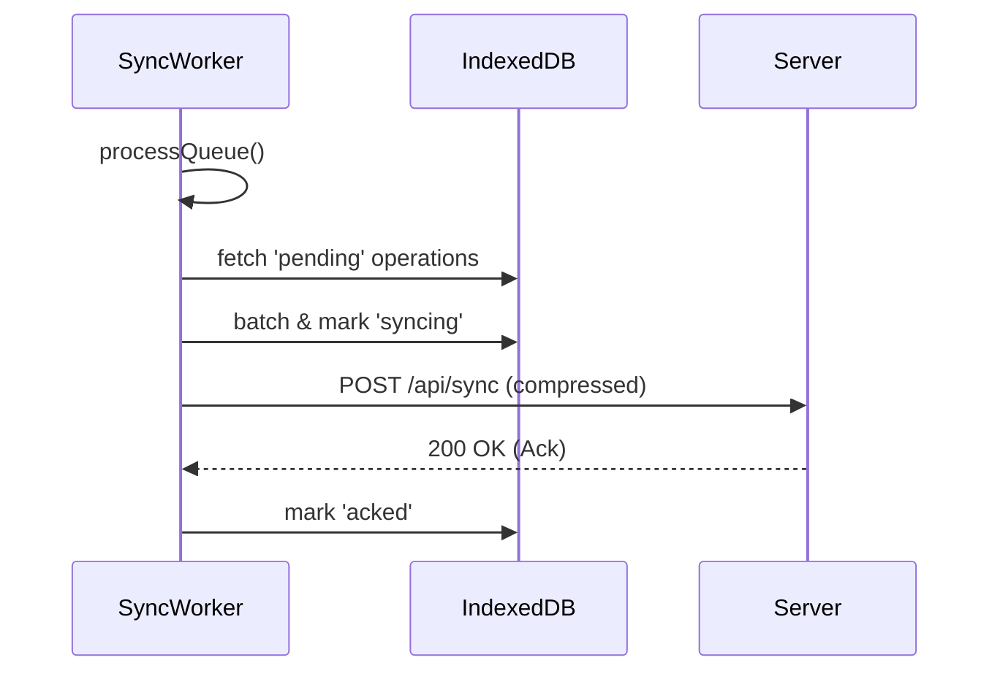
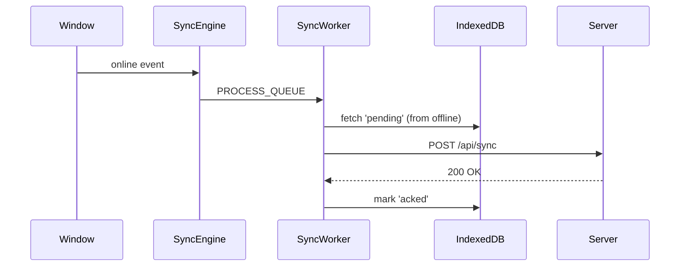
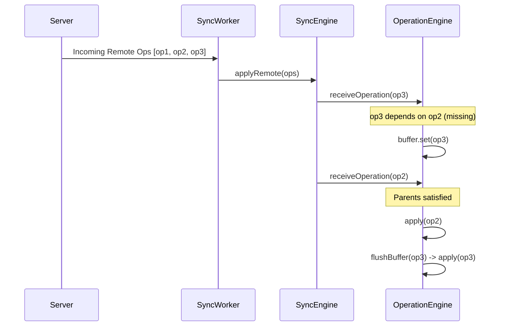
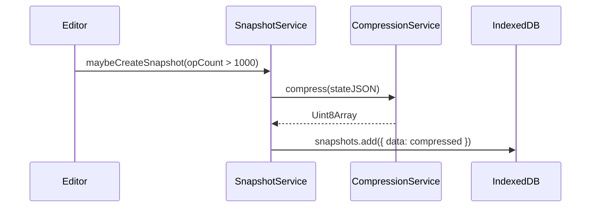
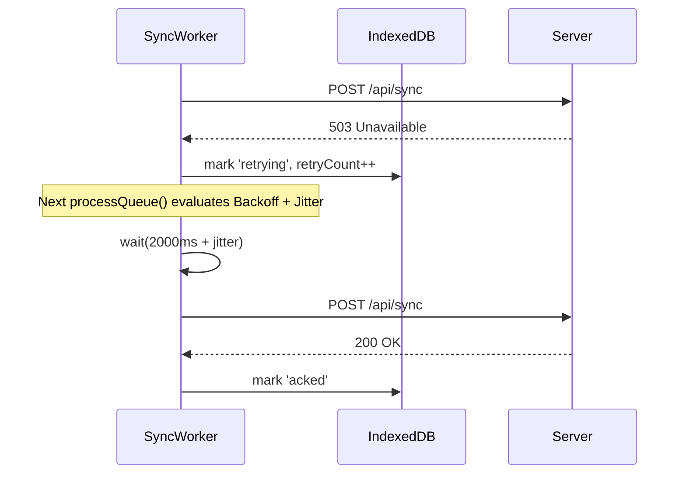
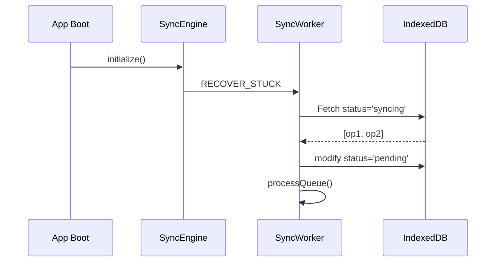

# Sync Engine Sequence Diagrams

## 1. Typing (Editor -> Engine -> IndexedDB -> Queue)

## 2. Offline Editing

## 3. Background Sync

## 4. Reconnect

## 5. Conflict Resolution & Causal Buffering

## 6. Snapshot Creation (Adaptive)

## 7. Queue Retry (Exponential Backoff)

## 8. Crash Recovery

